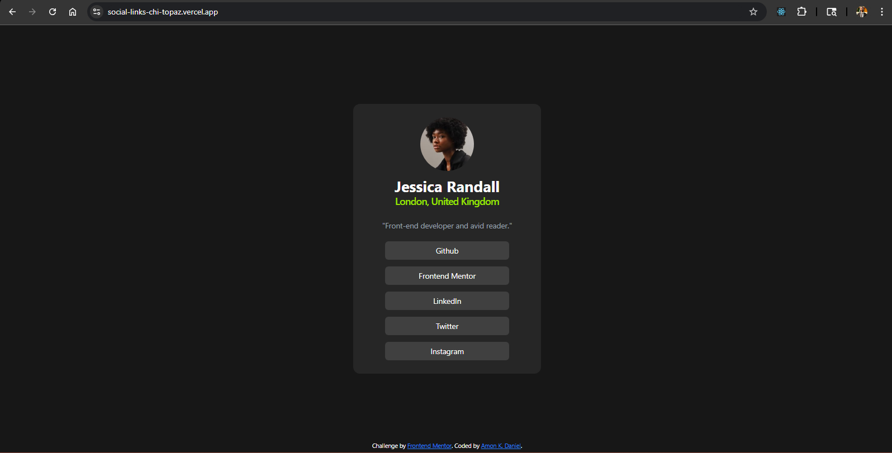

# Frontend Mentor - Social links profile solution

This is a solution to the [Social links profile challenge on Frontend Mentor](https://www.frontendmentor.io/challenges/social-links-profile-UG32l9m6dQ). Frontend Mentor challenges help you improve your coding skills by building realistic projects.

## Table of contents

- [Overview](#overview)
  - [The challenge](#the-challenge)
  - [Screenshot](#screenshot)
  - [Links](#links)
- [My process](#my-process)
  - [Built with](#built-with)
  - [What I learned](#what-i-learned)
  - [Continued development](#continued-development)
  - [Useful resources](#useful-resources)
- [Author](#author)
- [Acknowledgments](#acknowledgments)

**Note: Delete this note and update the table of contents based on what sections you keep.**

## Overview

### The challenge

Users should be able to:

- See hover and focus states for all interactive elements on the page

### Screenshot



### Links

- Solution URL: https://github.com/Genesys-jr/social-links.git
- Live Site URL: https://social-links-chi-topaz.vercel.app

## My process

### Built with

- [Tailwind CSS](https://tailwindcss.com/) - CSS framework
- Mobile-first workflow
- [React](https://reactjs.org/) - JS library
- [vite](https://vite.dev/) - React framework

### What I learned

I learned how to design repsonsive design on all devices. A little bit of the map function in javascript

To see how you can add code snippets, see below:

```js
const Socials = () => {
  const socials = [
    { name: "Github", url: "https://github.com" },
    { name: "Frontend Mentor", url: "https://www.frontendmentor.io" },
    { name: "LinkedIn", url: "https://www.linkedin.com" },
    { name: "Twitter", url: "https://twitter.com" },
    { name: "Instagram", url: "https://www.instagram.com" },
  ];
  return (
    <div className="flex flex-col justify-center items-center space-y-4 mt-6">
      {socials.map((social, index) => (
        <a
          key={index}
          href={social.url}
          className="text-white text-lg hover:bg-lime-400 hover:text-black transition-colors flex justify-center bg-neutral-700 rounded-lg py-2 w-full max-w-xs px-20 "
          target="_blank"
          rel="noopener noreferrer"
        >
          {social.name}
        </a>
      ))}
    </div>
  );
};

export default Socials;

};
```

### Continued development

I want to continue developing my tailwind responsive design,all round better frontend designs and also get comfortable writing logics like the one in the code snippet

### Useful resources

- [Tailwind CSS](https://tailwindcss.com/) - This helped me in reasearching better CSS classes for my responsive designs. I like the way it is documented

## Author

- Frontend Mentor - [@Genesys-jr](https://www.frontendmentor.io/profile/Genesys-jr)
